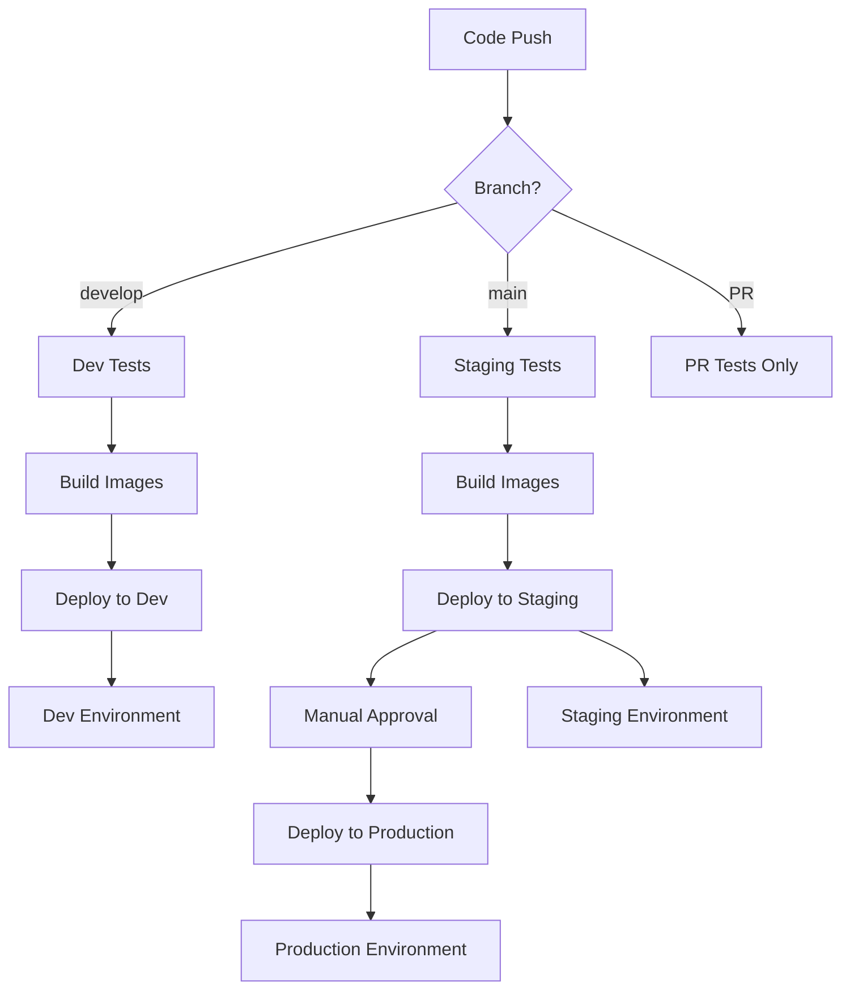

# TaskTracker CI/CD Quick Reference

## 🚀 Quick Setup (Automated)

### Option 1: Use the Setup Script (Bash)
```bash
# Make script executable
chmod +x setup-cicd.sh

# Run the setup script
./setup-cicd.sh
```

### Option 2: Use the Setup Script (PowerShell)
```powershell
# Run the PowerShell setup script
.\setup-cicd.ps1
```

## 📋 Prerequisites Checklist

- [ ] Azure CLI installed (`az --version`)
- [ ] GitHub CLI installed (`gh --version`)
- [ ] Logged into Azure (`az login`)
- [ ] Logged into GitHub (`gh auth login`)
- [ ] Contributor access to Azure subscription
- [ ] Owner/Admin access to GitHub repository

## 🔄 Pipeline Triggers

| Event | Environment | Action |
|-------|-------------|--------|
| Push to `develop` | Development | Deploy to Azure Container Instances |
| Push to `main` | Staging | Deploy to Azure App Service |
| Manual approval | Production | Deploy to Production App Service |
| Pull Request | - | Run tests only |

## 🌍 Environment Overview

### Development
- **Trigger**: Push to `develop` branch
- **Platform**: Azure Container Instances
- **Database**: Cosmos DB (MongoDB API)
- **Auto-deploy**: Yes

### Staging
- **Trigger**: Push to `main` branch
- **Platform**: Azure App Service
- **Database**: Cosmos DB (MongoDB API)
- **Auto-deploy**: Yes

### Production
- **Trigger**: Manual approval after staging
- **Platform**: Azure App Service
- **Database**: Cosmos DB (MongoDB API)
- **Auto-deploy**: After approval

## 🔐 Authentication

### Managed Identity Configuration
- Uses Azure Managed Identity with federated credentials
- No secrets stored for Azure authentication
- Separate federated credentials for `main`, `develop`, and PR branches

### Required GitHub Secrets
```
AZURE_CLIENT_ID      # Managed Identity Client ID
AZURE_TENANT_ID      # Azure Tenant ID
AZURE_SUBSCRIPTION_ID # Azure Subscription ID
ACR_NAME             # Container Registry Name
ACR_REGISTRY         # Container Registry URL
ACR_USERNAME         # Container Registry Username
ACR_PASSWORD         # Container Registry Password
```

### Required GitHub Environment Variables
```
# Development Environment
RESOURCE_GROUP_NAME  # rg-tasktracker-dev

# Staging Environment  
RESOURCE_GROUP_NAME  # rg-tasktracker-staging
APP_SERVICE_NAME     # tasktracker-staging-XXXXX

# Production Environment
RESOURCE_GROUP_NAME  # rg-tasktracker-prod
APP_SERVICE_NAME     # tasktracker-prod-XXXXX
```

## 🛠️ Manual Commands

### Create GitHub Environment
```bash
gh api --method PUT repos/:owner/:repo/environments/ENVIRONMENT_NAME
```

### Set GitHub Secret
```bash
gh secret set SECRET_NAME --body "SECRET_VALUE"
```

### Set Environment Variable
```bash
gh api --method PUT repos/:owner/:repo/environments/ENV_NAME/variables/VAR_NAME \
  --field name='VAR_NAME' \
  --field value='VAR_VALUE'
```

### Deploy Manually
```bash
# Login to Azure
az login

# Deploy to App Service
az webapp config container set \
  --name APP_SERVICE_NAME \
  --resource-group RESOURCE_GROUP_NAME \
  --docker-custom-image-name REGISTRY/IMAGE:TAG
```

## 🐛 Troubleshooting

### Common Issues

1. **Authentication Failed**
   - Check federated credentials are correctly configured
   - Verify managed identity has proper RBAC assignments
   - Ensure GitHub secrets are set correctly

2. **Container Registry Access Denied**
   - Verify ACR credentials in GitHub secrets
   - Check managed identity has `AcrPush` role

3. **Deployment Failed**
   - Check resource group names in environment variables
   - Verify app service names are correct
   - Check Azure resource availability

4. **Tests Failing**
   - Ensure test files are properly created
   - Check test dependencies in requirements.txt/package.json

### Useful Commands

```bash
# Check pipeline status
gh run list

# View pipeline logs
gh run view RUN_ID

# Check Azure resources
az resource list --resource-group rg-tasktracker-dev

# Check app service logs
az webapp log tail --name APP_NAME --resource-group RESOURCE_GROUP

# Test container locally
docker build -t tasktracker-backend ./backend
docker run -p 8000:80 tasktracker-backend
```

## 📞 Support

For issues with:
- **GitHub Actions**: Check `.github/workflows/ci-cd.yml`
- **Azure Resources**: Use `az --help` or Azure portal
- **Docker**: Check `Dockerfile` in backend/frontend directories
- **Tests**: Look at test files in `backend/tests/` and `frontend/src/`

## 🔄 Pipeline Flow



---

*Last updated: December 2024*